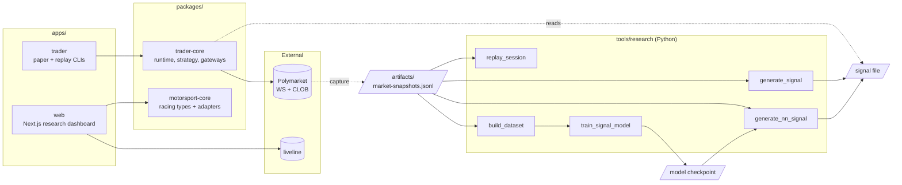

# Poly

Poly is now a monorepo with two product tracks:

- a Polymarket trading runtime in TypeScript plus Python research tooling
- a Next.js research workbench that scores live prediction values against future realized midpoints

## Workspace Layout

- `apps/trader`: CLI entrypoints for the paper and replay bots
- `apps/web`: Next.js prediction research frontend powered by `liveline`
- `packages/trader-core`: shared Polymarket bot runtime, strategy, gateways, and tests
- `packages/motorsport-core`: racing-domain types, replay/demo adapters, and Liveline transforms
- `tools/research`: Python replay, dataset-building, and signal-generation sidecar

## Repo Map

## Quick Start

1. Copy `.env.example` values into `.env`
2. Set `POLYMARKET_CHAIN_ID`, `POLYMARKET_MARKET_ID`, and `POLYMARKET_TOKEN_ID` for the market you want the web app to score
3. Install everything:
   `make install`
4. Start the web app:
   `pnpm dev:web`
5. Run the paper bot:
   `make paper`

## Useful Commands

- Install everything: `make install`
- Install research training extras: `make install-train`
- Type-check the workspace: `make check`
- Run tests: `make test`
- Build the workspace: `make build`
- Run the web app locally: `pnpm dev:web`
- Paper bot: `make paper`
- Replay bot: `make replay REPLAY_INPUT_PATH=artifacts/market-snapshots.jsonl`
- Generate a baseline signal:
  `make signal INPUT=artifacts/market-snapshots.jsonl MARKET=<market-id>`
- Train the neural signal model:
  `make train-signal INPUT=artifacts/market-snapshots.jsonl MARKET=<market-id> MODEL_OUT_DIR=artifacts/models/latest`
- Generate a neural signal:
  `make signal-nn INPUT=artifacts/market-snapshots.jsonl MARKET=<market-id> CHECKPOINT=artifacts/models/latest/best-checkpoint.npz`
- Summarize a captured session:
  `make summary INPUT=artifacts/market-snapshots.jsonl`

## Toolchain Guardrail

- Shared tooling stays root-owned: `typescript`, `vitest`, `oxlint`, and `oxfmt` should be declared once in the root `package.json`.
- Workspace packages should reuse the root toolchain instead of redeclaring those dependencies locally.
- Adding a competing lint/test/format/compile tool should happen only as part of an explicit repo-wide migration.

## Web App Notes

- The homepage is now a live research dashboard for one configured Polymarket market.
- If those market env values are missing or invalid, the web app stays up and shows an inline setup checklist instead of returning a 500.
- Predictions are sampled every 30 seconds and scored against the first valid midpoint at `+5 minutes`.
- Accuracy is currently defined as `abs(predictionValue - truthValue) <= 0.02`.
- The neural research loop trains against that same `+5 minute` target and reports validation MAE plus the existing band-accuracy metric.
- The legacy motorsport package remains in the repo, but it is no longer the active web surface.

## Trading Runtime Notes

- Default mode is paper trading only.
- Live market data now uses the Polymarket market WebSocket; `POLL_INTERVAL_MS` remains replay-only.
- Live execution is guarded behind `ALLOW_LIVE_EXECUTION=true`.
- The bot ignores missing, stale, malformed, or cross-market signal files and falls back to rules-only quoting.
- A kill switch file at `KILL_SWITCH_FILE` can stop quoting with either `stop`, `true`, or JSON such as `{"stop": true, "reason": "manual stop"}`.
